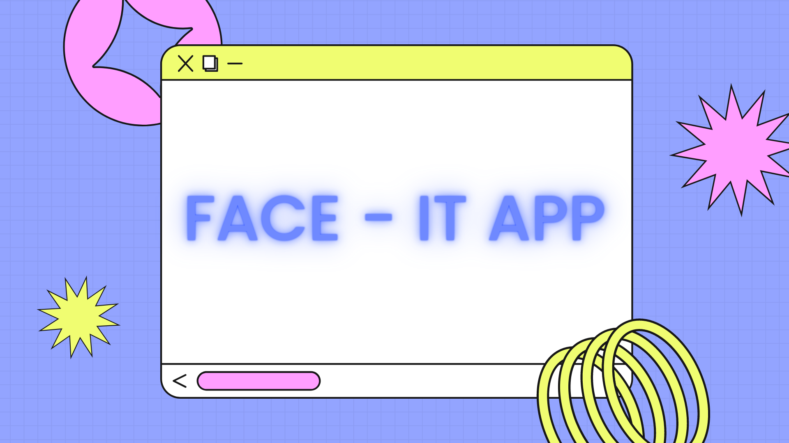
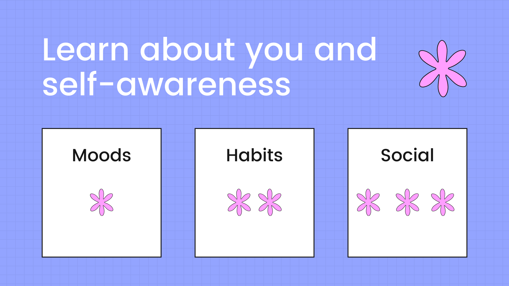
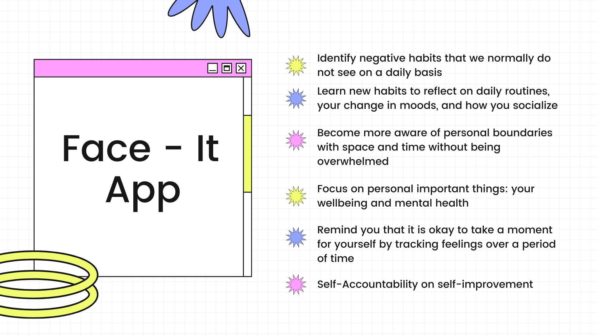
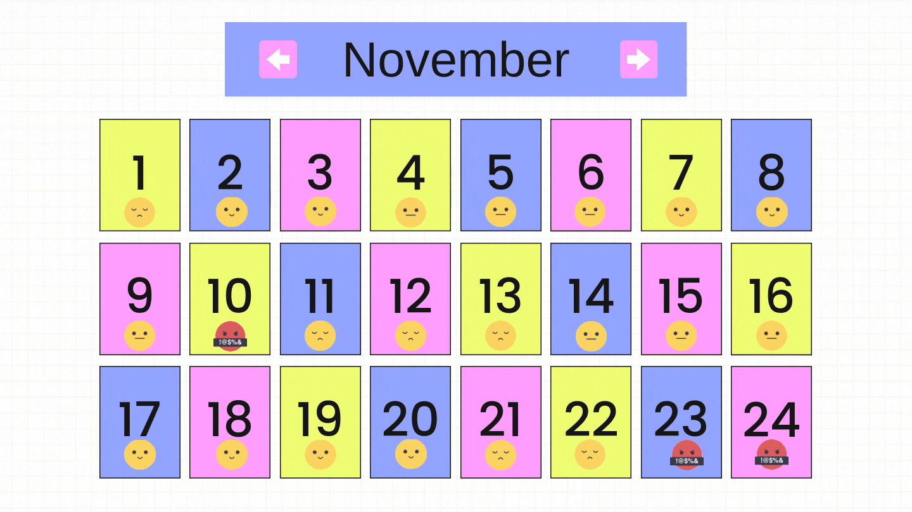

# The Face - It App

Team CodeOp's repo for Athena Winter Hackathon

1. [Introductions](#introductions)
2. [Project Objective](#objective)
6. [Installation](#installation)
7. [Dependencies](#dependencies)
8. [Create New Component/Feature or Continue Working on Existing Feature](#create-staging)
9. [Start New Component/Feature](#create-branch)

## <a name="introductions">Introductions</a>
We are Lina, Corinna, Sol, Maria and Donna from the interational coding bootcamp [CodeOp](https://codeop.tech/). This is our first hackathon ever and our group submission to the [Winter 2021 Athena Hackathon!](https://athenahacks.com/). 

## <a name="objective">Project Objective:</a>

### Topic:

   Life during COVID-19 has impacted us to our very core. Many people suffered from depression, became very hostile, distant, and desperate to get back to normalcy. Some of the many contributing factors that affect how we feel are based on our ability to have a routine, interact with people, our habits, sleep, and exercise. Our personal experiences during lock down made it difficult to stay motivated to work on self care.

   We realized need reminders and accountability for ourselves to make progress work. But how can we keep ourselves responsible? How can we motivate ourselves? How can we see improvement when we start new challenges? How do we promote interaction and socialization? The Face - It App aims to make it simple and to the point to help us identify our negative habits and bring more self-awareness that it is okay to take a moment for ourselves. The Face - It App opens up to a breathing exercise without signing up to promote mindfulness in moments.

### Solution: 

   Our stack is made of React, CSS, Bootstrap, Node.JS, Express, and MySQL. We decided to go with a form to collect the mood as a range from 1 to 5, and then 4 questions with yes/no answers which are translated into values. We created a functions to have a normalize value of all those input so that on each day we see an emoji related to the values. We assigned a max value of 8 and min of -4, and a mid low of 2 and a mid low of 4.

## <a name="installation">Installation</a>

   <b>Note: This prototype uses the (yarn)[https://yarnpkg.com/] package manager. </b>

   If you are using Windows, to make life easy be sure you are using [Git Bash](https://git-scm.com/downloads) and not Windows Powershell, or Windows Command Terminal. Each has their own command syntax.

   1. On GitHub for [this repo](https://github.com/lucidInsomniac/team-codeop-athena-hack.git), click on the "Fork" icon that looks like a "Y". This creates a your copy on your GitHub.

   2. Click on the green "Code" button, and copy the URL from your version on GitHub.

   3. On your computer, open Git Bash, and find, or create a folder to clone your copied repo.

            mkdir project-folder

             cd project-folder

             git clone https://github.com/yourUsername/team-codeop-athena-hack.git

   4.  Once the repo clones successfully, change into the project folder:

            cd team-codeop-athena-hack

   5. Since we are using yarn, initiate yarn to allow adding dependencies. 

            yarn

   6. Add team repo to your remote connection, and check it got added:

            git remote add team https://github.com/lucidInsomniac/team-codeop-athena-hack.git

            git remote -v

      You should see two listed for "origin", this is your GitHub copied version. This is where you will push to staging.

      There will also be two listed as "team". this is your team repo. This is where you will pull before, and after every pull and push.

## <a name="create-staging">Create Staging Branch on Your Local Repo/Computer</a>

   1. Create a new branch on your local repo/ your computer, called "staging" and switch into this branch. This is where all the changes will go.

            git checkout -b staging

   2. Save the changes to your local repo and commit.

            git add .

            git commit -m "created staging branch"

   3. Push your new staging branch on your local repo/computer to your remote repo/GitHub. This will create a new staging branch on your GitHub:

            git push origin staging

   4. On your GitHub, a pop-up with a green button will appear with something like "Compare & Pull Request". Click confirm these merges but DO NOT DELETE when it pops up with the purple indicator. 

   5. On GitHub, your main will not update, unless you click on your staging branch and click on the green "Create Pull Request" button. This is only if everything looks okay and is functional. 

## <a name="create-branch">Create New Component/Feature or Continue Working on Existing Feature</a>

   1. In Bash, make sure you are in the staging branch:

            git branch

   2. If you are not in the staging brach, use and check:

            git checkout staging

            git branch

   3. Synchronize and update your local repo's staging branch with the TEAM repo:

            git pull -rebase team staging

   4. You most likely will not have any conflicts, resolve them before moving on. Current is the TEAM's repo, Incoming is your changes. Then save, commit, push.

   5. Create a new branch for each new feature and switch into it:

          git checkout -b newFeature

   If you are working on an EXISTING BRANCH, use this:

        git checkout newFeature

   6. On your local repo/computer, merge your staging branch into your new created branch so you start with current code.

   7. Save, commit, pull from the team repo,if conflicts show, resolve: save and commit again.

          git add .

          git commit -m "created new feature"

   8. Before we push, we need to make sure we are current with the team repo, so we will update one more time. Resolve any conflicts: save and commit.

          git pull --rebase team staging

   9. Push to your GitHub with a new feature branch:

          git push origin newFeature

   10. On your GitHub, a pop-up will show Compare and Pull Request from your new feature branch to main branch. Select staging instead of main, then click confirm merge. 

   11. Another Pull Request will pop-up and ask to merge from staging to main. As long as everything works, confirm the merge.  

## <a name="dependencies">Dependencies</a>

   ### Backend Dependencies 

   1. In the project folder "team-codeop-athena-hack", select the package.json and look at what is listed:

                {
                        "name": "team-codeop-athena-hack",
                        "version": "1.0.0",
                        "license": "MIT",
                        "scripts": {
                        "start": "nodemon ./bin/www",
                        "migrate": "node model/database.js"
                        },
                        "dependencies": {
                        "cookie-parser": "^1.4.5",
                        "dotenv": "^10.0.0",
                        "express": "^4.17.1",
                        "http-errors": "^1.8.0",
                        "migrate": "^1.7.0",
                        "morgan": "^1.10.0",
                        "mysql": "^2.18.1",
                        "nodemon": "^2.0.15"
                        },
                        "proxy": "http://localhost:5000"
                }

   2. Install the following:

          yarn add cookie-parser dotenv express http-errors migrate morgan mysql nodemon

   3. Run yarn one more time:

          yarn 

   4. In the project folder "team-codeop-athena-hack, right click and create new file called ".env" file for database.
